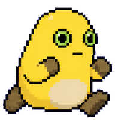
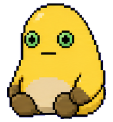
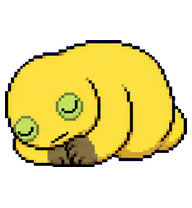
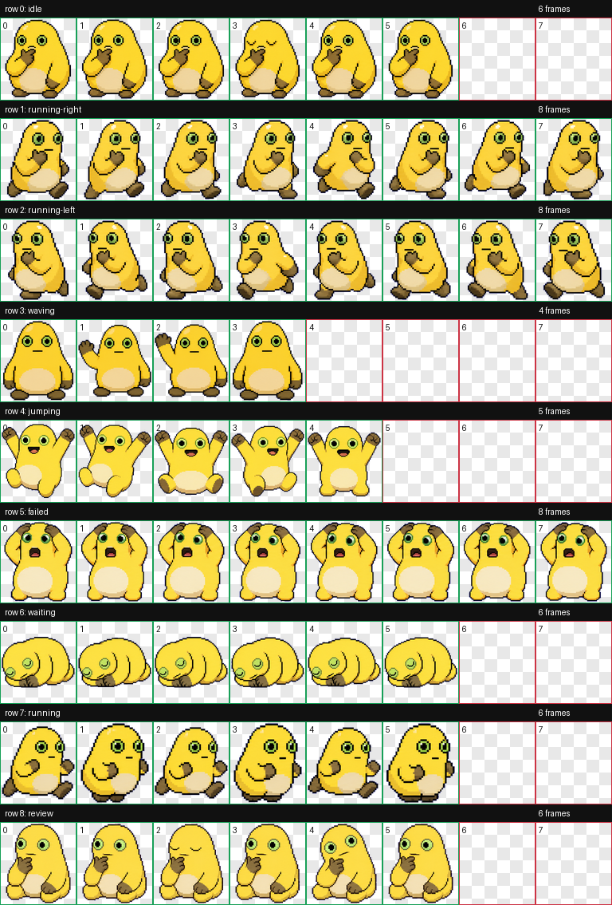

# Yellow Thinker Pet (奶蛙版)

一只会思考、会摸鱼、会庆祝、也会崩溃和睡觉的 Codex 桌宠。  
这个项目把社区常见“奶龙变种奶蛙”气质做成了可直接导入 Codex 的宠物包。

## 这是什么

这是一个完整的 `hatch-pet` 产物仓库，包含：

- 生成提示词（prompts）
- 各状态行图与拆帧（decoded / frames）
- 最终图集（final/spritesheet.webp）
- 可直接安装包（package/pet.json + package/spritesheet.webp）

如果你也想做自己的宠物，这个仓库可以直接当模板参考。

## 状态预览

Codex 实际使用固定状态键名，我们做了语义一一对应：

### `idle`（待机）

### `review`（思考 / thinking）

### `running`（工作 / working）

### `jumping`（成功 / success）

### `failed`（报错 / error）

### `waiting`（睡觉 / sleeping）

也可以直接看总览图：

## 怎么用

把下面两个文件放到本地 Codex 宠物目录（例如 `~/.codex/pets/yellow-thinker/`）：

- `yellow-thinker-run/package/pet.json`
- `yellow-thinker-run/package/spritesheet.webp`

然后在 Codex 里切换到这个宠物即可。

## 仓库结构

主要内容都在 `yellow-thinker-run/`：

- `prompts/rows/*.md`：每个状态的生成约束
- `decoded/`：状态行图
- `frames/`：拆帧后的单帧 png
- `final/`：最终图集与校验结果
- `qa/`：质检结果与联系表
- `package/`：可分发宠物包

## 复现流程（简版）

1. 用 `prepare_pet_run.py` 初始化 run 目录
2. 用 imagegen 逐状态生成并 `record_imagegen_result.py` 录入
3. `finalize_pet_run.py` 合成最终图集
4. `package_custom_pet.py` 打包产出

## 已知说明

- 某些 Windows 环境下，预览视频步骤可能报临时目录权限错误（`WinError 5`），但不影响宠物包使用。
- “宠物是否总在最上层”是 Codex App 窗口层级行为，不由素材文件本身决定。

---

如果你喜欢这只奶蛙，欢迎继续二创：换配色、换表情、换动作，整活空间很大。
